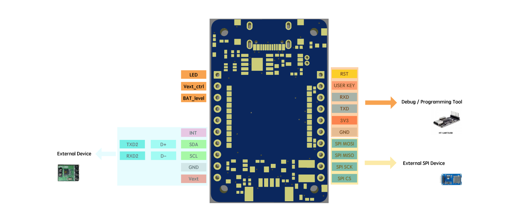

# MAIN BOARD Project

**Description:** An overview of the primary function and the standardized pin-out rules for main communication boards in the SILIQS LPWAN IoT PCB initiative, fostering easy interchangeability and expansion.

## Introduction to SILIQS Project Mainboards

The SILIQS project's mainboards are engineered as the foundational components of our IoT solutions, designed to seamlessly integrate into a variety of IoT applications. These boards are central to our vision of creating a versatile, expandable, and user-friendly IoT ecosystem.

## Purpose of the Mainboards

Each mainboard within the SILIQS project is crafted to serve as the backbone of IoT devices, facilitating communication and operational efficiency. While detailed specifications of individual boards vary, the collective aim is to provide a reliable platform for developing and deploying IoT solutions that can adapt and scale with technological advancements and application requirements.

## Standardized Pin-Out Rules

To ensure compatibility and ease of swapping between mainboards, the SILIQS project has adopted a set of standardized pin-out rules:

* **Power Supply:** Defined pins for power supply inputs, supporting a range of voltages for flexibility in battery and power sourcing.
* **Communication Interfaces:** Standardized positions for key communication interface pins, such as SPI, I2C, and UART, to support a wide array of peripheral devices and modules.
* **Digital and Analog IO:** Specific slots allocated for digital and analog input/output to cater to various sensors and actuators.
* **Expansion Port:** An allocated expansion port designed with future growth in mind, enabling the addition of new modules and capabilities without redesigning the mainboard.

These rules are crafted to maximize interoperability between boards, ensuring that upgrades or replacements can be made with minimal disruption to the existing infrastructure. This approach not only enhances the flexibility of the SILIQS ecosystem but also encourages innovation and evolution within the project.

## Looking Forward

As we continue to develop and expand the SILIQS project, these guidelines will play a crucial role in maintaining a cohesive and forward-compatible ecosystem. By adhering to these standardized pin-out rules, we lay the groundwork for future expansions and innovations, ensuring that the SILIQS project remains at the forefront of IoT development.

For further engagement or to contribute towards the evolution of our project, we invite you to connect with us through our [Community Forum](mainboards.md) or [GitHub Repository](mainboards.md).
