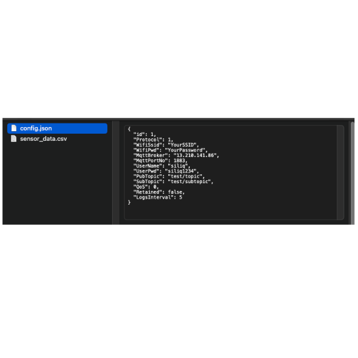
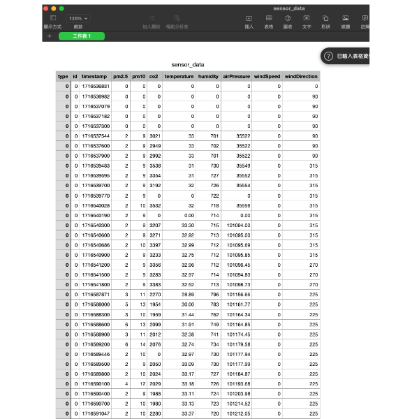

# SQSNC001 (U.D)

English | [中文](./#中文)

## SQ-SNC001: Weather Station Data Collection and Recorder


### Overview

The SQ-SNC001 is a versatile weather station data collection device designed to gather sensor data via RS485/Modbus, store it locally on an SD card, and forward it to a web cloud platform. It supports multiple communication methods, including WiFi and NB-IoT, and is powered by a solar panel with an internal battery charger for lead-acid batteries.

### Key Features

* Collect sensor data via RS485/Modbus
* Publish data to MQTT server via WiFi or NB-IoT
* Solar-powered with an internal battery charger for lead-acid batteries
* Local storage on an SD card (up to 32GB)

### Application Scenarios

* Weather Stations
* Agriculture
* Building Environmental Monitoring
* General Environmental Monitoring

### Technical Specifications

* **CPU:** Dual-core Arm Cortex-M0+ processor, flexible clock running up to 133 MHz, 264kB on-chip SRAM
* **Power Source Interface:** Solar charger power source (+18V\~30V)
* **Battery Port:** Lead-acid battery (+12V) port x2
* **Communication Port:** RS485/Modbus port with power driving (+12V) x1
* **Connectivity:** NB-IoT, WiFi
* **Storage:** SD Card (supports max. 32GB)
* **GPS:** Reserved

### Usage Guide

#### Connection Guide

**Solar Panel**

Connect the solar panel to the power source interface.


**Lead-Acid Battery**

Install your lead-acid battery in the main battery port near the solar power interface.


**12V Power Output**

The 12V power output is reserved for future use. Leave it open if not needed.


**RS485 Communication Port**

The SQ-SNC001 supports two Modbus/RS485 communication ports. By default, use Port 1 labeled A1, B1, and leave Port 2 open.

**Port 1**

By default, connect the SQS-LUV800 to this port.


**Port 2**

Reserved for future use.


#### Setup

**Connecting Weather Sensor via RS485 Outside Cable Bus**


**Connecting Solar Panel via Outside Cable Bus**


**Connecting Lead-Acid Battery via Inside Cable Bus**


**SD Card Slot**


**SIM Card Slot**


#### Initial Setup of Your System

The SQ-SNC001 uses an SD card file to set up the system. Initially, the SD card is empty. You must add a file named `config.json` using an editor on your computer (e.g., Notepad on Windows, TextEdit on Mac). The file `sensor_data.csv` will be created and updated by the SQ-SNC001. You only need to copy it to your computer. When initializing a new record, delete the `sensor_data.csv` file, leaving only `config.json` on the SD card.



**How to Set Up Publish Mode**

The SQ-SNC001 supports WiFi and NB-IoT modes to publish data, but they cannot work simultaneously. Users can configure the system using a `config.json` file.

Use the following JSON format to set up the SQ-SNC001:

```json
{
	"id":1, // INT
	"Name":"<Station Name>",//Set the nick name Max. 8bytes
	"Protocol":1,// 1=NB-IOT, 2=WIFI
	"WifiSsid":"<Your SSID>",// Set your WiFi SSID, avoiding any special characters other than a space
	"WifiPwd":"<SSID Password>",// Set your WiFi password, avoiding any special characters other than a space
	"MqttBroker":"13.210.141.86",// MQTT server address
	"MqttPortNo":1883,// MQTT port
	"UserName":"siliq",// Set MQTT server username
	"UserPwd":"siliq1234",// Set MQTT server password
	"PubTopic":"test_v2/topic",// Set MQTT publish topic
	"SubTopic":"test_v2/subtopic",// Set MQTT subscribe topic
	"QoS":0,// QoS: 0 = At most once, 1 = At least once, 2 = Exactly once
	"Retained":false,// Retained: true means the broker retains the last message, valid values: true, false
	"LogsInterval":5,// Unit: minute, valid values: 2, 3, 4, 5, 6, 10, 15, 20, 30
	"Latitude":25.04022, // location message latitude
	"Longitue":121.61406,// location message longitue
	"Altitude":5.21,// location message altitude
	"DebugMessage":true //Make DebugMessage_YYYYMMDD.txt in SD CARD
}
```

Here is the template with the remarks removed as requested:

```json
{
	"id":1, 
	"Name":"<Station Name>",
	"Protocol":1,
	"WifiSsid":"<Your SSID>",
	"WifiPwd":"<SSID Password>",
	"MqttBroker":"13.210.141.86",
	"MqttPortNo":1883,
	"UserName":"siliq",
	"UserPwd":"siliq1234",
	"PubTopic":"test_v2/topic",
	"SubTopic":"test_v2/subtopic",
	"QoS":0,
	"Retained":false,
	"LogsInterval":5,
	"Latitude":25.04022, 
	"Longitue":121.61406,
	"Altitude":5.21,
	"DebugMessage":true
}
```

**How to Read Local Records**

Read the SD card on your computer. It should contain a file named `sensor_data.csv`. The data may appear as shown below.



### INDEX LEDS

The SQ-SNC001 supports 2 \* 3-color-LED indicators for system information. LED1 is the default indicator. LED2 is reserved.


#### LED1

Supports 3 independent LEDs with red, blue, and green colors.

**Indications**

Sure! Here's the updated table based on your specifications:

| Index | Condition              | Red LED       | Green LED     | Blue LED      |
| ----- | ---------------------- | ------------- | ------------- | ------------- |
| 1     | Power Error            | OFF           | OFF           | OFF           |
| 2     | System Power On Period | ON            | ON            | ON            |
| 3     | SD Card Read Error     | Blinking Slow | Blinking Slow | Blinking Slow |
| 4     | Network Error          | ON            | Blinking Slow | Blinking Fast |
| 5     | Sensor Read Error      | ON            | Blinking Slow | ON            |
| 6     | SD Card Write Error    | ON            | Blinking Slow | Blinking Slow |

#### Legend:

* **ON**: LED is continuously on.
* **OFF**: LED is off.
* **Blinking Slow**: LED is blinking at a slow interval (1 sec).
* **Blinking Fast**: LED is blinking at a fast interval (0.2 sec).

#### Explanation:

1. **Power Error**: All LEDs are off, indicating a power error.
2. **System Power On Period**: All LEDs are on, indicating the system is powering on.
3. **SD Card Read Error**: All LEDs blink slowly, signifying an issue with reading the SD card.
4. **Network Error**: The Red LED is on, the Green LED blinks slowly, and the Blue LED blinks fast, indicating a network error.
5. **Sensor Read Error**: The Red and Blue LEDs are on, and the Green LED blinks slowly, indicating a sensor read error.
6. **SD Card Write Error**: The Red LED is on, and both the Green and Blue LEDs blink slowly, indicating an issue with writing to the SD card.

### Additional Resources

(Include links or references to additional resources, manuals, or support documents.)

&#x20;

***

***

&#x20;

### 中文

## SQ-SNC001: 氣象站數據收集與記錄器


### 概述

SQ-SNC001是一款多功能氣象站數據收集設備，能夠通過RS485/Modbus收集傳感器數據，將其存儲在本地SD卡上，並將數據轉發到雲平台。它支持多種通信方式，包括WiFi和NB-IoT，並由太陽能面板供電，內部配有鉛酸電池充電功能。

### 主要特點

* 通過RS485/Modbus收集傳感器數據
* 通過WiFi或NB-IoT將數據發佈到MQTT伺服器
* 太陽能供電，內部配有鉛酸電池充電功能
* 本地存儲在SD卡上（最大支持32GB）

### 應用場景

* 氣象站
* 農業
* 建築環境監測
* 總體環境監測

### 技術規格

* **CPU:** 雙核Arm Cortex-M0+處理器，靈活時鐘運行頻率可達133 MHz，264kB片上SRAM
* **電源接口:** 太陽能充電電源（+18V\~30V）
* **電池接口:** 鉛酸電池（+12V）接口 x2
* **通信接口:** 帶驅動電源的RS485/Modbus接口（+12V）x1
* **連接:** NB-IoT，WiFi
* **存儲:** SD卡（最大支持32GB）
* **GPS:** 保留

### 使用指南

#### 連接指南

**太陽能面板**

將太陽能面板連接到電源接口。


**鉛酸電池**

將鉛酸電池安裝在靠近太陽能電源接口的主電池端口。


**12V電源輸出**

12V電源輸出保留供未來使用。如果不需要，請保持開放狀態。


**RS485通信接口**

SQ-SNC001支持兩個Modbus/RS485通信接口。默認情況下，使用標有A1、B1的1號端口，並保持2號端口開放。

**1號端口**

默認情況下，將SQS-LUV800連接到此端口。


**2號端口**

保留供未來使用。


#### 設置

**通過RS485外部電纜總線連接氣象傳感器**


**通過外部電纜總線連接太陽能面板**


**通過內部電纜總線連接鉛酸電池**


**SD卡插槽**


**SIM卡插槽**


#### 系統初始設置

SQ-SNC001使用SD卡文件進行系統設置。初始情況下，SD卡是空的。您需要使用電腦上的編輯器（如Windows的Notepad，Mac的TextEdit）添加一個名為`config.json`的文件。SQ-SNC001將創建並更新`sensor_data.csv`文件。您只需要將其複製到電腦上。初始化新記錄時，刪除`sensor_data.csv`文件，只保留`config.json`在SD卡上。


**如何設置發佈模式**

SQ-SNC001支持WiFi和NB-IoT模式來發佈數據，但它們不能同時工作。用戶可以使用`config.json`文件配置系統。

使用以下JSON格式設置SQ-SNC001：

```json
{
	"id":1, // INT
	"Name":"<Station Name>",//Set the nick name Max. 8bytes
	"Protocol":1,// 1=NB-IOT, 2=WIFI
	"WifiSsid":"<Your SSID>",// Set your WiFi SSID, avoiding any special characters other than a space
	"WifiPwd":"<SSID Password>",// Set your WiFi password, avoiding any special characters other than a space
	"MqttBroker":"13.210.141.86",// MQTT server address
	"MqttPortNo":1883,// MQTT port
	"UserName":"siliq",// Set MQTT server username
	"UserPwd":"siliq1234",// Set MQTT server password
	"PubTopic":"test_v2/topic",// Set MQTT publish topic
	"SubTopic":"test_v2/subtopic",// Set MQTT subscribe topic
	"QoS":0,// QoS: 0 = At most once, 1 = At least once, 2 = Exactly once
	"Retained":false,// Retained: true means the broker retains the last message, valid values: true, false
	"LogsInterval":5,// Unit: minute, valid values: 2, 3, 4, 5, 6, 10, 15, 20, 30
	"Latitude":25.04022, // location message latitude
	"Longitue":121.61406,// location message longitue
	"Altitude":5.21,// location message altitude
	"DebugMessage":true //Make DebugMessage_YYYYMMDD.txt in SD CARD
}
```

使用時請移除備註部分如下範本:

```json
{
	"id":1, 
	"Name":"<Station Name>",
	"Protocol":1,
	"WifiSsid":"<Your SSID>",
	"WifiPwd":"<SSID Password>",
	"MqttBroker":"13.210.141.86",
	"MqttPortNo":1883,
	"UserName":"siliq",
	"UserPwd":"siliq1234",
	"PubTopic":"test_v2/topic",
	"SubTopic":"test_v2/subtopic",
	"QoS":0,
	"Retained":false,
	"LogsInterval":5,
	"Latitude":25.04022, 
	"Longitue":121.61406,
	"Altitude":5.21,
	"DebugMessage":true
}
```

**如何讀取本地記錄**

在您的電腦上讀取SD卡。它應包含一個名為`sensor_data.csv`的文件。數據可能如下所示。


### 指示燈

SQ-SNC001支持2個3色LED指示系統信息。LED1是默認指示燈。LED2保留。


#### LED1

支援 3 個獨立的 LED，分別為紅色、藍色和綠色。

**指示**

以下是根據您的規格更新的表格：

| 指數 | 條件       | 紅色 LED | 綠色 LED | 藍色 LED |
| -- | -------- | ------ | ------ | ------ |
| 1  | 電源錯誤     | 關閉     | 關閉     | 關閉     |
| 2  | 系統啟動期間   | 常亮     | 常亮     | 常亮     |
| 3  | SD 卡讀取錯誤 | 慢速閃爍   | 慢速閃爍   | 慢速閃爍   |
| 4  | 網路錯誤     | 常亮     | 慢速閃爍   | 快速閃爍   |
| 5  | 感測器讀取錯誤  | 常亮     | 慢速閃爍   | 常亮     |
| 6  | SD 卡寫入錯誤 | 常亮     | 慢速閃爍   | 慢速閃爍   |

#### 備註：

* **常亮**: LED 持續亮。
* **關閉**: LED 關閉。
* **慢速閃爍**: LED 以慢速間隔閃爍（1 秒）。
* **快速閃爍**: LED 以快速間隔閃爍（0.2 秒）。

#### 說明：

1. **電源錯誤**: 所有 LED 關閉，表示電源錯誤。
2. **系統啟動期間**: 所有 LED 常亮，表示系統正在啟動。
3. **SD 卡讀取錯誤**: 所有 LED 慢速閃爍，表示 SD 卡讀取問題。
4. **網路錯誤**: 紅色 LED 常亮，綠色 LED 慢速閃爍，藍色 LED 快速閃爍，表示網路錯誤。
5. **感測器讀取錯誤**: 紅色和藍色 LED 常亮，綠色 LED 慢速閃爍，表示感測器讀取錯誤。
6. **SD 卡寫入錯誤**: 紅色 LED 常亮，綠色和藍色 LED 慢速閃爍，表示 SD 卡寫入問題。

### 附加資源

（包括連結或引用附加資源、手冊或支持文檔。）
