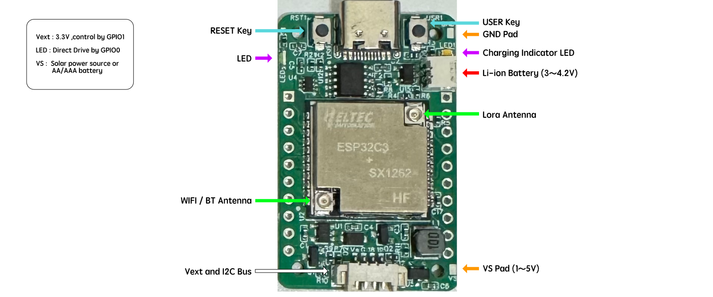
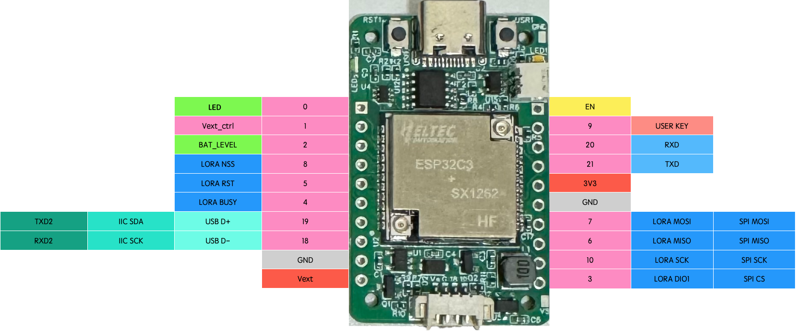
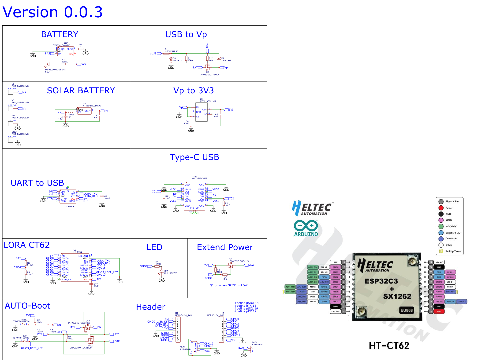

# SQ001S (M.P)

## Overview of the Development Board

Designed with the needs of both hobbyists and professionals in mind, this cutting-edge development board is tailored for advanced projects in the realms of the Internet of Things (IoT) and environmental technologies. Anchored by a powerful central processing unit, it delivers a comprehensive set of capabilities suitable for a wide array of applications.

## Key Features

* **Central Processing Unit**: Employs a RISC-V processor at 160MHz, ensuring robust computational and processing power.
* **Arduino Compatibility**: Fully supports the Arduino ecosystem, enabling effortless programming and project development for users.
* **Integrated PCB Antenna**: Features support for WiFi and BLE, offering advanced connectivity and data transmission options.
* **Index LED Feature**: Designed for custom lighting and signaling, enhancing user interaction and feedback.
* **Li-ion Battery Management**: Includes sophisticated circuitry for managing Li-ion batteries, promoting safe and efficient energy use.
* **Solar Charging Capability**: Equipped with a unique solar charger circuit, allowing for the charging of batteries via solar panels and boosting the output to 5V.
* **Boost Power Management Circuit**: Enhances the power source capability by boosting input from as low as 1.0V to 5.0V, significantly increasing the range of power sources that can be used.
* **Extensive Connectivity**: Comes with two 2.54-10 connectors for breadboard integration and a 1.25-4 connector for external sensors and devices.

## Additional Resources

### Pinout

### Schematic

### Datasheet

* [HT\_CT62 Datasheet](HTCT62.pdf)

## Potential Applications

This board is excellently suited for diverse applications, notably:

* IoT infrastructure development
* Remote sensing operations
* Environmental monitoring
* Enhancements in smart agriculture

## Getting Started Guide

Initiate your journey with the SQ001S development board by:

1. Installing the latest version of the Arduino IDE suitable for your operating system.
2. Connecting the board to your computer using a USB cable.
3. Following instructions to install necessary drivers and libraries.
4. Exploring the board's possibilities through sample projects.

## Community Contributions and Support

We foster community involvement and offer various support options:

* **Contributions**: Guidelines for those looking to contribute are readily available.
* **Support Channels**: Reach out to our support team or use our GitHub issue tracker for assistance or to report issues.

## License Information

This development board is made available under the MIT License, affording a wide latitude for development and distribution in both personal and commercial projects.
